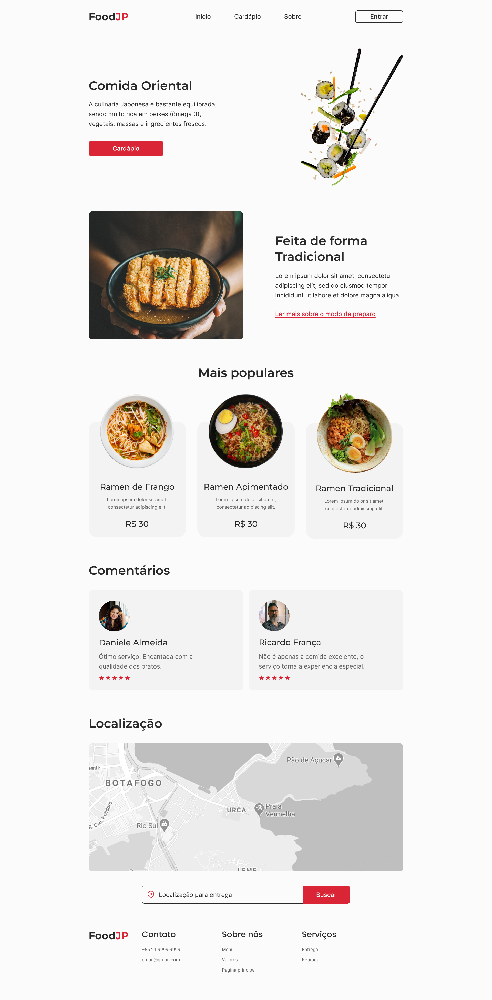
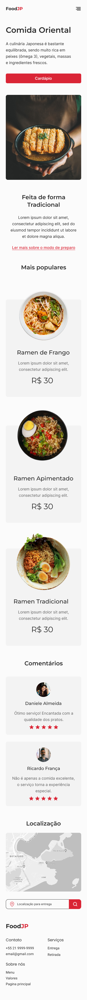
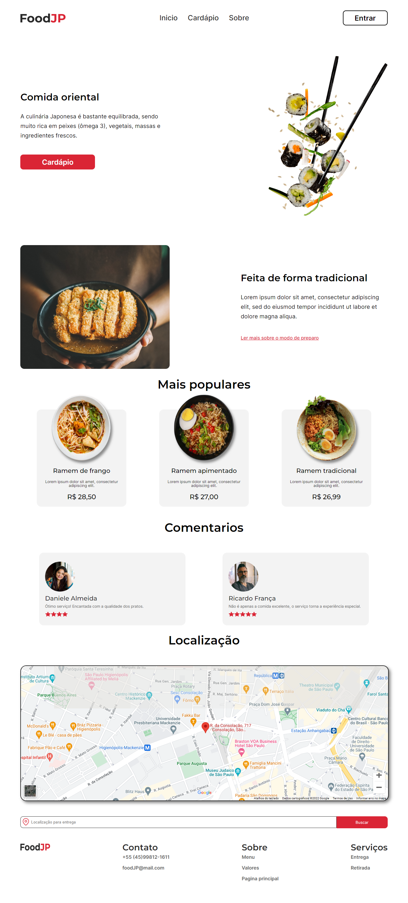

# FoodJP 

## 🎯 Desafio:
Com base no layout proposto, foi desenvolvido uma página de apresentação responsiva.
 
## Layout disponibilizado:
### Desktop

<a href="https://www.figma.com/file/aJVStp1M2BUQ2lPmbGuBjr/Desafios---Codel%C3%A2ndia-(Copy)?node-id=107967%3A1220">Clique aqui para acessar o layout</a> 
 

### Mobile

<a href="https://www.figma.com/file/aJVStp1M2BUQ2lPmbGuBjr/Desafios---Codel%C3%A2ndia-(Copy)?node-id=107967%3A1220">Clique aqui para acessar o layout</a> 
 

## 🚀 Resultado: 

<a href="https://food-jp-codelandia.vercel.app/">Clique aqui para acessar o site</a> 

## ⚒️ Tecnologias utilizadas:
* JavaScript
* HTML5
* CSS3
* ReactJs
* SASS